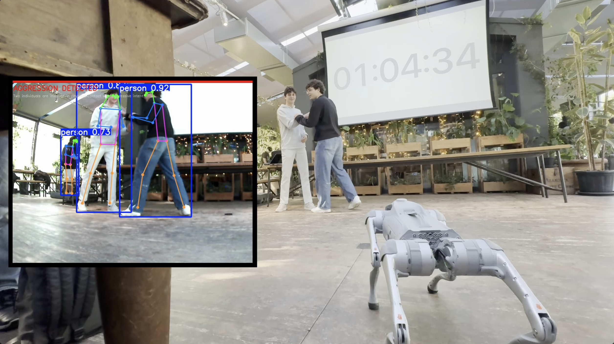

# Lumi Robotics

Real-time urban safety monitoring powered by a **hybrid computer vision + LLM approach**, running on a Unitree Go2 Pro robot dog.



---

## Overview

Lumi Robotics combines classical computer vision and a multimodal AI agent to analyze live video streams and detect critical situations — starting with aggressive interactions between people.

The core idea is a **hybrid pipeline**: YOLOv8 handles fast, frame-level pose estimation while GPT-4o Vision provides deep scene understanding across temporal sequences of frames. Neither model alone is sufficient — together they achieve both speed and accuracy.

Detected events are structured in real time and can be forwarded via webhook to any downstream system — a safety dashboard, an alerting service, or direct reporting infrastructure. The goal is to shift urban safety monitoring from static, reactive data to a dynamic and proactive system.

---

## Architecture

```
Unitree Go2 Pro
      │
      │  live video stream (MJPEG / WebRTC)
      ▼
┌─────────────────────────────────────┐
│         Detection Pipeline          │
│                                     │
│  YOLOv8 pose  ──►  live overlay     │
│                                     │
│  frame buffer  ──►  GPT-4o Vision   │
│                  ──►  scene state   │
└──────────────┬──────────────────────┘
               │  structured event
               ▼
    alert / webhook / log
```

The pipeline classifies every scene into three states:

| State | Description |
|---|---|
| `safe` | Normal interaction — walking, talking, standing |
| `suspect` | Aggressive intent detected — hands raised toward another person |
| `aggression` | Physical contact confirmed — grabbing, pushing, fighting |

---

## Quickstart

```bash
# 1. Clone the repo
git clone https://github.com/lumiRobotics/lumi-robotics
cd lumi-robotics

# 2. Install dependencies
pip install -r requirements.txt

# 3. Configure
cp .env.example .env
# Open .env and set your OPENAI_API_KEY

# 4. Run
python main.py                            # webcam
python main.py --source video --video path/to/file.mp4
python main.py --source robot             # Unitree Go2
```

---

## Video sources

| Source | Command |
|---|---|
| Webcam | `python main.py` |
| Video file | `python main.py --source video --video path.mp4` |
| Unitree Go2 | `python main.py --source robot` |

---

## Unitree Go2 — automatic setup

Use the unified launcher. On the first run it auto-clones and installs the [hfarmai/unitree-go2-control](https://github.com/hfarmai/unitree-go2-control) relay server, scans the local WiFi for the robot, and saves the IP to `.env`.

```bash
python start.py --source robot
```

**Requirements:** robot and PC on the same WiFi network, robot powered on.

On subsequent runs the IP is already saved — skip the network scan:

```bash
python start.py --source robot --skip-discovery
```

To scan for the robot manually:

```bash
python discovery.py        # scan once
python discovery.py --wait # keep retrying until found
```

---

## Alerts

Set `ALERT_MODE` in `.env`:

| Value | Behavior |
|---|---|
| `print` | Print to terminal *(default)* |
| `file` | Append to `alerts.log` |
| `webhook` | POST JSON to `ALERT_WEBHOOK_URL` |

Webhook payload:
```json
{
  "event": "fight",
  "confidence": 0.9,
  "timestamp": "2026-04-16 12:00:00"
}
```

---

## Configuration

Copy `.env.example` to `.env` and edit:

| Variable | Default | Description |
|---|---|---|
| `OPENAI_API_KEY` | — | **Required.** Your OpenAI API key |
| `ALERT_MODE` | `print` | Alert output mode |
| `ALERT_WEBHOOK_URL` | — | Webhook URL (only for `webhook` mode) |
| `VIDEO_SOURCE` | `webcam` | Default source if `--source` is not passed |
| `ROBOT_IP` | — | Auto-filled by `start.py` |
| `CONFIDENCE_THRESHOLD` | `0.65` | Detection confidence threshold |

---

## Project structure

```
main.py          — main detection loop
detector.py      — hybrid GPT-4o Vision + YOLOv8 pose pipeline
video_source.py  — webcam / robot stream / video file abstraction
alert.py         — alert system (print / file / webhook)
discovery.py     — finds the Unitree Go2 on the local network
start.py         — unified launcher with auto-setup
config.py        — configuration loaded from .env
models/          — custom YOLOv8 violence detection model
assets/          — images and media
tests/           — unit tests
```

---

## Running the tests

```bash
pip install pytest
python -m pytest tests/ -v
```

No robot, webcam, or OpenAI key required — all external dependencies are mocked.

---

## Requirements

- Python 3.10+
- OpenAI API key with access to GPT-4o
- For robot mode: Unitree Go2 on the same WiFi network

---

## License

MIT License — see [LICENSE](LICENSE).
